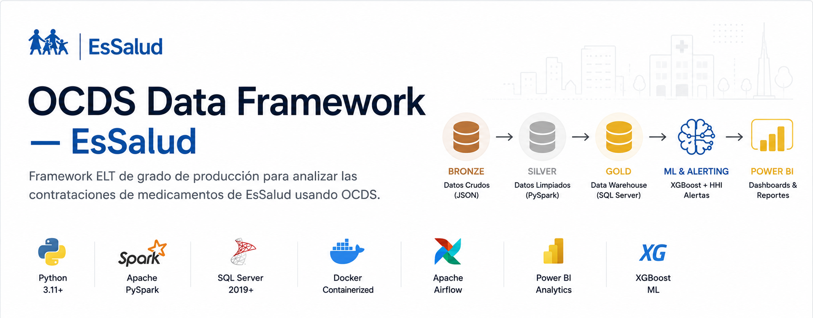
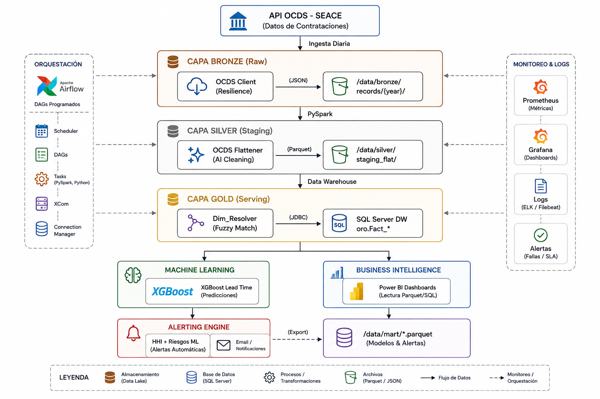
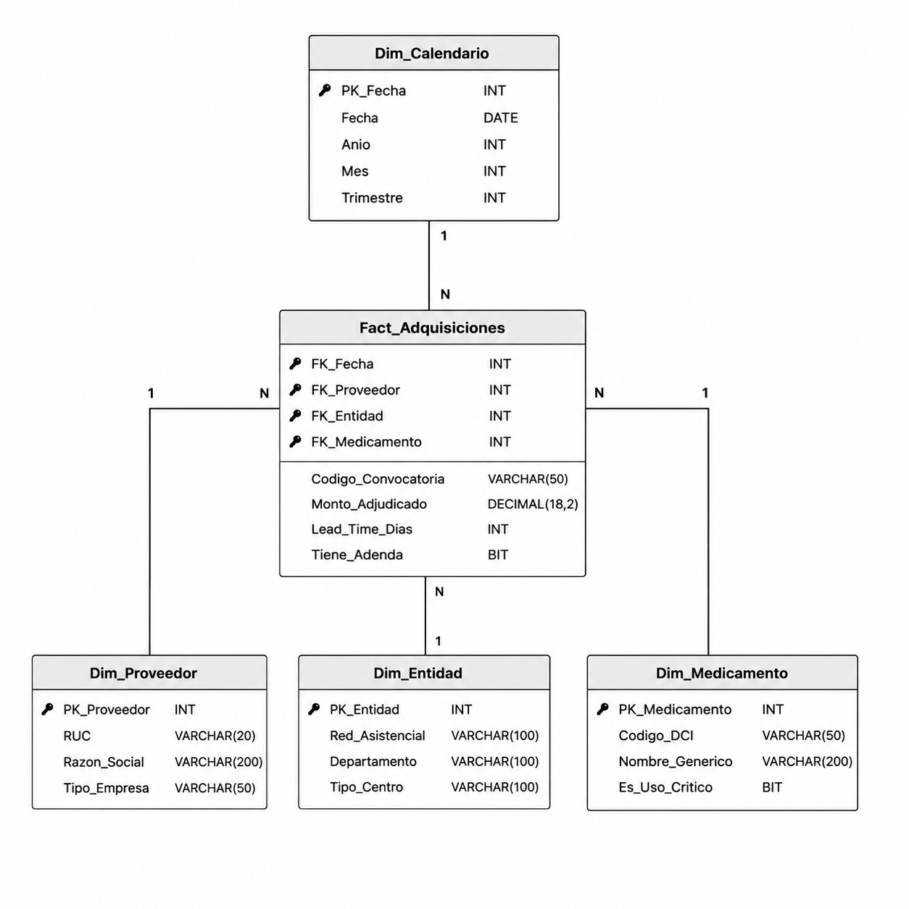

# OCDS Data Framework — EsSalud

      

Un framework **ELT** de grado de producción en Python que implementa la **Arquitectura Medallón** (Bronze → Silver → Gold) para extraer, procesar y analizar datos del Portal de Contrataciones Abiertas del Perú (estándar **OCDS**), evaluando la eficiencia de las compras de medicamentos de **EsSalud**.

---

## Tabla de Contenidos

- [Overview](#overview)
- [Arquitectura](#arquitectura)
- [Fuente de Datos (Dataset)](#fuente-de-datos-dataset)
- [Estructura del Proyecto](#estructura-del-proyecto)
- [Primeros Pasos](#primeros-pasos)
- [Resumen del Pipeline](#resumen-del-pipeline)
- [Documentación](#documentación)
- [Contribución](#contribución)

---

## Overview

El análisis de las contrataciones públicas es crucial para garantizar el abastecimiento eficiente de medicamentos. Este proyecto provee un pipeline de ingeniería de datos completo y reproducible que:

- **Extrae** datos masivos (Bulk) o dirigidos (Targeted) desde la API del Sistema Electrónico de Contrataciones del Estado (SEACE) hacia una capa Bronze.
- **Limpia y enriquece** los registros en la capa Silver usando PySpark para el manejo de JSON anidados y LLMs (Gemini) para normalización de texto.
- **Modela** los datos analíticos en una capa Gold (Esquema Estrella) cargada en SQL Server.
- **Predice y alerta** ineficiencias usando modelos de Machine Learning (XGBoost) para estimar Lead Times contractuales y notificar riesgos de monopolio (HHI).

### Decisiones de Diseño Clave

| Decisión | Justificación |
|---|---|
| **Arquitectura Medallón** | Separación estricta de responsabilidades entre ingesta cruda, datos limpios/curados, y métricas de negocio. |
| **PySpark para Transformaciones** | Manejo eficiente de JSONs altamente anidados (estándar OCDS) y cruces difusos (fuzzy matching) a gran escala. |
| **SQL Server como Data Warehouse** | Permite una integración directa y segura con Power BI Service en el entorno corporativo de EsSalud. |
| **Modelo Híbrido de Almacenamiento** | Disco local para procesamiento rápido, con replicación opcional hacia Cloudflare R2 para resiliencia en la capa Bronze. |

---

## Arquitectura



El flujo de datos sigue un orden canónico orquestado por **Apache Airflow**:

```
Bronze (API Requests) ──► Silver (PySpark ETL) ──► Gold (Star Schema JDBC)
```

### Esquema Estrella (Capa Gold)

Para facilitar las consultas analíticas (OLAP) y la integración con BI, la capa Gold modela los datos consolidados en un Esquema Estrella:



---

## Fuente de Datos (Dataset)

Los datos se consumen del Portal del Estado Peruano en formato OCDS (Open Contracting Data Standard).

- **Portal Base**: [Contrataciones Abiertas de la OSCE](https://contratacionesabiertas.oece.gob.pe/)
- **Entidad Compradora Target**: Seguro Social de Salud (EsSalud) - RUC 20131257750

### Archivos de Búsqueda (Lookups)
El pipeline utiliza archivos base para enriquecer la data extraída:
- `petitorio_nacional.xlsx`: Catálogo de medicamentos y especialidades médicas.
- `maestro_entidades.xlsx`: Diccionario de Redes Asistenciales y ubicaciones de EsSalud.

---

## Estructura del Proyecto

```text
essalud-pipeline/
├── app/                    # Código fuente principal (extractores, pipelines, servicios)
│   ├── cli.py              # CLI Medallion principal
│   └── scripts/            # Scripts utilitarios (ej. load_ml_to_sql.py)
├── assets/                 # Recursos gráficos y diagramas
├── dags/                   # DAGs de Apache Airflow
├── data/                   
│   └── mart/               # Capa Gold exportada a Parquet (BI / Reportes)
├── docs/                   # Documentación detallada del framework
├── machine_learning/       # Modelos predictivos y aplicaciones de IA
│   ├── adenda_risk_classifier/  # Clasificador de riesgo de adendas (Streamlit)
│   └── lead_time_predictor/     # Modelo XGBoost de Lead Time en días
├── reference/              # Excel de referencia y datos base (Lookups)
├── sql/                    # DDL del modelo estrella en SQL Server
├── test/                   # Suite de pruebas unitarias y de integración (Pytest)
├── docker-compose.yaml     # Stack: Airflow + SQL Server DW + MailHog
└── requirements.txt        # Dependencias de producción
```

---

## Primeros Pasos

### Prerrequisitos
- Docker Desktop
- Python 3.11+
- Java JRE 17+ (requerido para PySpark local)

### 1. Clonar y Configurar

```bash
git clone <repository-url>
cd essalud-pipeline
python -m venv .venv
.\.venv\Scripts\Activate.ps1
pip install -r requirements.txt
cp .env.example .env
```

### 2. Levantar la Infraestructura Docker

Inicia Airflow, SQL Server y MailHog:

```bash
docker compose build
docker compose up airflow-init
docker compose up -d
```

### 3. Ejecutar el Pipeline (Vía CLI)

```bash
# (a) Extraer datos desde la API
python app/cli.py bronze --years 2023 2024

# (b) Procesar y cargar a Data Warehouse
python app/cli.py silver --rebuild
python app/cli.py synth
python app/cli.py gold --target sqlserver --profile docker
```

---

## Resumen del Pipeline

### Bronze Layer — Ingesta Cruda
Descarga de expedientes paginados (Targeted) o volcados mensuales (Bulk) desde la API de OSCE en archivos `.json` crudos, particionados por año y proveedor.

### Silver Layer — Limpieza y Enriquecimiento
- **Aplanamiento:** Desanidamiento del árbol JSON OCDS (Tender, Awards, Contracts, Items) a formato tabular.
- **Limpieza de IA:** Normalización de nombres de hospitales y redes asistenciales mediante la API de Google Gemini.
- **Resolución:** Fuzzy matching contra el Petitorio Nacional de Medicamentos.

### Gold Layer — Dimensiones y Métricas
Creación de la Fact Table (`Fact_Ordenes_Y_Contratos`) y tablas de dimensión asociadas. Además, incluye:
- Cálculo del índice **HHI** para riesgo de monopolio.
- Generación de predicciones de **Lead Time** con XGBoost.
- Disparo de alertas automáticas vía SMTP.

---

## Documentación

El directorio [`docs/`](docs/) contiene guías detalladas para todos los perfiles del proyecto:

- 📖 **[Guía de Ejecución y Runbook](docs/guia-ejecucion.md)**
- 🏛️ **[Arquitectura de la Solución](docs/arquitectura.md)**
- 📊 **[Diccionario de Datos](docs/diccionario-datos.md)**
- 🤖 **[Modelo Predictivo](docs/modelo-predictivo.md)**
- ⚡ **[Alertas Automatizadas](docs/alertas-automatizadas.md)**
- 🛠️ **[Guía de Desarrollo](docs/guia-desarrollo.md)**

---

## Contribución

Revisar la **[Guía de Desarrollo](docs/guia-desarrollo.md)** para detalles sobre convenciones de código, testing con Pytest y el flujo de CI/CD.

1. Haz un fork del repositorio.
2. Crea tu rama de características (`git checkout -b feature/nueva-extraccion`).
3. Ejecuta los tests locales (`pytest test/`).
4. Abre un Pull Request contra `main`.
